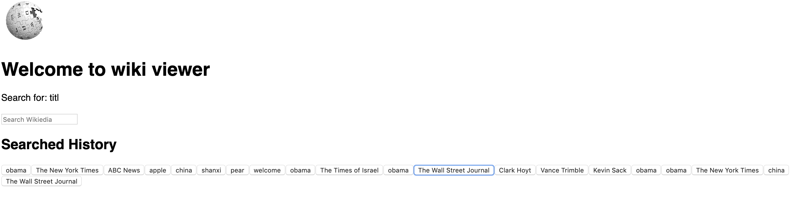

# Wiki Viewer

## Author
- [Karen Cao](https://qimincao.github.io/HomePage_Karen/)

## Screenshot



## Project Objective

This web app is for the final exam.

CS5610 Course Link: http://johnguerra.co/classes/webDevelopment_spring_2019/ 

## Usage

First please make sure you have installed meteor, mongoDB, and React.

Then run the following commands in your terminal.

```
git clone https://github.com/QiminCao/wiki-viewer.git
cd wiki-viewer
meteor npm install
meteor
```
Open your browser and visit http://localhost:3000 and you should see the application.

## Technologies

- Platform: [Meteor](https://www.meteor.com/) with React - An open source platform for 
web, mobile, and desktop.
- API: [Wikipedia API](https://www.npmjs.com/package/node-wikipedia)

## License
[](https://opensource.org/licenses/MIT)

This repository has the standard [MIT license](https://opensource.org/licenses/MIT). 